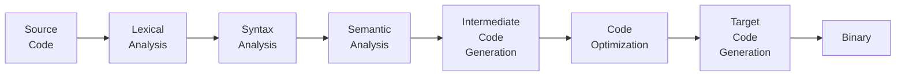

# 3.2 Macro System

## What are macros?

- Also referred to as syntax extensions.
- A way of writing code that writes other code.
- A form of meta programming.
- Compile time process.

## Compilation process

You can think of compilation as a big function where the input parameter is your source code, and the return value is an executable. Inside the big function there are smaller functions that analyze and process your code. The first three steps of the compilation process are `Lexical`, `Syntax`, and `Semantic` analyzes as you see below in the diagram.



After that intermediate representation of your code is generated, optimized, and finally turned into assembly to produce a binary.

We will focus on first three steps of compilation process to understand macro system better.

### Lexical Analysis

- From the perspective of the compiler, your source code starts off as a meaningless text file. The job of the lexical analysis is to turn this meaningless text into a stream of tokens, and then classify the tokens.
- Tokens can be grouped into several categories:
  - Identifiers
  - Literals
  - Keywords
  - Symbols
- The stream of tokens are turned into a stream of token trees.
  - Almost all tokens are token trees themselves, specifically leaf nodes.
  - The only non-leaf nodes are grouping tokes such as parenthesis, brackets, or curly braces.
- Macros in Rust deals with tokens and token trees.

### Syntax Analysis

- It turns a stream of token trees into an Abstract Syntax Tree
- Representing the syntax structure of your program.
- The nodes of syntax tree could be literals, function calls, if-else branches, and more.
- Using the AST, programs like linters, test coverage tools, transpilers are implemented.

> ℹ️ **INFO**
>
> In Rust, `macros` are processed or expanded after the AST is constructed, but prior to semantic analysis.

### Semantic Analysis

- After all macros are expanded, semantic analysis checks to make sure the AST semantically makes sense.

Rust has two types of macros: Declarative Macros and Procedural Macros.

## Declarative Macros

It is similar to match expression.

```rust
// lib.rs (lib name macros)
/// macro_rules! name {
///     rule0;
///     rule1;
///     rule2;
///     // ...
///     ruleN;
/// }
///
/// (matcher) => { expansion aka transcriber }

#[macro_export] // used to export macro defined in library
macro_rules! hello {
    () => {
        println!("Hello");
    }
}

//main.rs

use macros::hello;

fn main() {
    hello!();
}
```

Another example including specifiers

```rust
//lib.rs
#[macro_export]
macro_rules! map {
    // $ [identifier]: [fragment-specifier]
    ($key: ty, $val: ty) => {{
        let map: HashMap<$key, $val> = HashMap::new();
        map
    }};
    // $ (...) sep rep
    // rep operators:
    // * : zero or more repetitions
    // ? : at most one repetition
    // + : one or more repetitions
    // sep operators must be `=>`, `,` , `;`
    ($($key: expr => $val: expr),*) => {{
        let mut map = HashMap::new();
        $(map.insert($key, $val);)*
        map
    }};
}

//main.rs
use macros::map;
// needed because macro uses HashMap
use std::collections::HashMap;

fn main() {
    let new_hash_map = map!(String, i32);
    let another_map = map!("test" => 1, "test1" => 2);
}
```

You can see list of all specifiers in Rust:

| Specifier   | Matches                                                                                        |
| ----------- | ---------------------------------------------------------------------------------------------- |
| `block`     | A block of code, e.g., `{ ... }`                                                               |
| `expr`      | An expression, e.g., `1 + 2`, `foo()`, or `if x { y } else { z }`                              |
| `expr_2021` | An expression excluding `const` blocks and underscore expressions (for backward compatibility) |
| `ident`     | An identifier, e.g., `foo`, `bar`                                                              |
| `item`      | An item, such as a function, struct, or module declaration                                     |
| `lifetime`  | A lifetime, e.g., `'a`                                                                         |
| `literal`   | A literal value, e.g., `42`, `"hello"`                                                         |
| `meta`      | A meta item, typically used in attributes, e.g., `cfg(...)`                                    |
| `pat`       | A pattern, e.g., `Some(x)`, `Ok(_)`                                                            |
| `pat_param` | A pattern without top-level alternation, used in function parameters                           |
| `path`      | A path, e.g., `std::io::Result`                                                                |
| `stmt`      | A statement, e.g., `let x = 5;`                                                                |
| `tt`        | A single token tree                                                                            |
| `ty`        | A type, e.g., `i32`, `Vec<T>`                                                                  |
| `vis`       | A visibility qualifier, e.g., `pub`, `pub(crate)`                                              |

## Procedural Macros

- Procedural macros allow us to define a function which takes token stream as an input and returns a token stream output rather than matching against patterns.
- Procedural macros must be defined its own crate with a special crate type `proc-macro` as you see below:
- `proc-macro` crate types cannot export any items other than functions tagged with `#[proc_macro]`, `#[proc_macro_derive]`, or `#[proc_macro_attribute]`

```toml
[package]
name = "macros"
version = "0.1.0"
edition = "2024"

[lib]
proc-macro = true

[dependencies]
```

```rust
//lib.rs

extern crate proc_macro;

// as an example
use proc_macro::{TokenStream};
```

There are three type of procedural macros: function like, attribute like, and custom drive.

### Function like procedural macros

You can see the example below:

```rust
// lib.rs
extern crate proc_macro;

use chrono::Utc;
use proc_macro::TokenStream;
use quote::quote;

#[proc_macro]
pub fn log_info(input: TokenStream) -> TokenStream {
    let mut output = "[info] ".to_owned();

    for token in input {
        let token_string = token.to_string();

        match token_string.as_str() {
            "[TIME]" => {
                let time = Utc::now().time().to_string();
                output.push_str(&format!("{} ", time));
            }
            _ => {
                output.push_str(&format!("{} ", token_string));
            }
        }
    }

    TokenStream::from(quote! {
        println!("{}", #output);
    })
}

// main.rs
use macros::log_info;

fn main() {
    log_info!([TIME] starting program...);
}
```

...and the output is:

```bash
[info] 14:00:07.586846 starting program . . .
```

### Custom derive procedural macros

It is explained in an example below:

```rust
// lib.rs

extern crate proc_macro;

use proc_macro::TokenStream;
use quote::quote;
use syn;

// Log is the name of the proc drive macro
#[proc_macro_derive(Log)]
pub fn log_derive(input: TokenStream) -> TokenStream {
    let ast: syn::DeriveInput = syn::parse(input).unwrap();
    let name = &ast.ident;

    let trait_impl = quote! {
        impl Log for #name {
            fn info(&self, msg: &str) {
                println!("[info] {}: {}", stringify!(#name),msg);
            }
            fn warn(&self, msg: &str) {
                println!("[warn] {}: {}", stringify!(#name),msg);
            }
            fn error(&self, msg: &str) {
                println!("[error] {}: {}", stringify!(#name),msg);
            }
        }
    };

    trait_impl.into()
}


// main.rs

use macros::*;

trait Log {
    fn info(&self, msg: &str);
    fn warn(&self, msg: &str);
    fn error(&self, msg: &str);
}

#[derive(Debug, Log)]
struct Database {
    url: String,
    connections: u32,
}

impl Database {
    fn new(url: String) -> Self {
        Database {
            url,
            connections: 0,
        }
    }

    fn connect(&mut self) {
        self.info(format!("new connection to {}", self.url).as_str());
        self.connections += 1;
        if self.connections > 10 {
            self.warn(format!("100 or more connections open").as_str());
        }
    }
}

fn main() {
    let mut db = Database::new("localhost::8888".to_owned());
    db.connect();

    for _ in 0..10 {
        db.connect();
    }
}
```

> ℹ️ **Info**
>
> Two important crates `quote`, `syn`, and `darling` used to write procedural derive macro.
>
> **quote**: generates Rust code as tokens using macro-like syntax.
>
> **syn**: parses Rust code into syntax tree (AST)
>
> Because procedural macros receive code as token streams
>
> **Need** to:
>
> 🧩 **Parse** them (using syn)
>
> ✏️ **Generate** new code (using quote)
>
> **darling**: crate in Rust is used to make writing procedural macros easier, especially when working with custom attributes.
>
> When you're building a procedural macro (like `#[derive(...)]`), you often need to:
>
> Parse attributes like `#[my_attr(foo = "bar", skip)]`
>
> Handle lots of repetitive parsing code
>
> 🔧 darling **does** that work for you. It helps you define a Rust struct and automatically maps the attributes to it.

## Attribute like procedural macros

It is explained by example below:

```rust
// lib.rs

extern crate proc_macro;

use darling::FromMeta;
use proc_macro::TokenStream;
use quote::ToTokens;
use syn::{AttributeArgs, FnArg, Ident, ItemFn, Pat, Stmt, parse_macro_input, parse_quote};

#[derive(FromMeta)]
struct MacroArgs {
    #[darling(default)]
    verbose: bool,
}

#[proc_macro_attribute]
pub fn log_call(args: TokenStream, input: TokenStream) -> TokenStream {
    let attr_args = parse_macro_input!(args as AttributeArgs);
    let mut input = parse_macro_input!(input as ItemFn);

    let attr_args = match MacroArgs::from_list(&attr_args) {
        Ok(v) => v,
        Err(e) => {
            return TokenStream::from(e.write_errors());
        }
    };

    impl_log_call(&attr_args, &mut input)
}

fn impl_log_call(attr_args: &MacroArgs, input: &mut ItemFn) -> TokenStream {
    let fn_name = &input.sig.ident;

    if attr_args.verbose {
        let fn_args = extract_arg_names(input);
        let statements = generate_verbose_logs(fn_name, fn_args);
        input.block.stmts.splice(0..0, statements);
    } else {
        input.block.stmts.insert(
            0,
            parse_quote! {
                println!("[Info] calling {}", stringify!(#fn_name));
            },
        );
    }

    input.to_token_stream().into()
}

fn extract_arg_names(func: &ItemFn) -> Vec<&Ident> {
    func.sig
        .inputs
        .iter()
        .filter_map(|arg| {
            if let FnArg::Typed(pat_type) = arg {
                if let Pat::Ident(pat) = &(*pat_type.pat) {
                    return Some(&pat.ident);
                }
            }
            None
        })
        .collect()
}

fn generate_verbose_logs(fn_name: &Ident, fn_args: Vec<&Ident>) -> Vec<Stmt> {
    let mut statements = vec![parse_quote!({
        print!("[Info] calling {} | ", stringify!(#fn_name));
    })];

    for arg in fn_args {
        statements.push(parse_quote!({
            print!("{} = {:?} ", stringify!(#arg), #arg);
        }));
    }

    statements.push(parse_quote!({
        println!();
    }));

    statements
}

// main.rs

use macros::*;

#[derive(Debug)]
struct Product {
    name: String,
    price: u32,
}

fn main() {
    let laptop = Product {
        name: "MacBook Pro".to_owned(),
        price: 2000,
    };

    buy_product(laptop, 20);
}

#[log_call(verbose)]
fn buy_product(product: Product, discount: u32) {
    //
}

```
